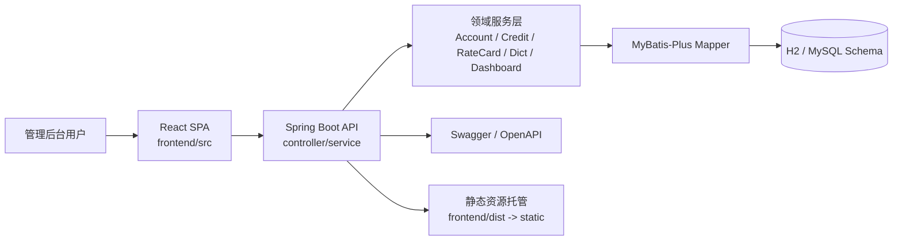
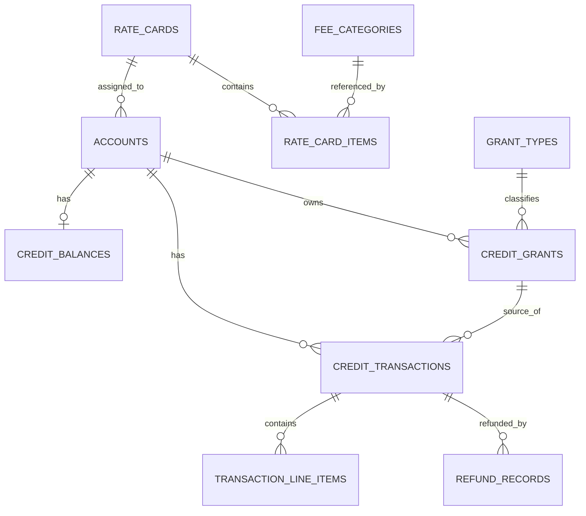

# Credits 项目架构文档

## 1. 文档目标

本文档基于当前代码实现整理，目标是回答以下几个问题：

- 这个项目解决什么业务问题
- 系统由哪些模块组成，边界如何划分
- 关键数据模型和核心流程是什么
- 前后端如何协作
- 当前实现的优点、限制和主要风险在哪里

本文档描述的是 `2026-03-31` 当前仓库状态，而不是理想设计图。

相关文档：

- [DATABASE.md](./DATABASE.md)：数据库模型、关键字段、索引与 MySQL 8.0 关键路径 SQL
- [CONSUMPTION_PATH_OPTIMIZATION.md](./CONSUMPTION_PATH_OPTIMIZATION.md)：消费扣减路径的后续优化思路

## 2. 项目概览

`credits` 是一个围绕 Credits 消耗模型构建的授信与收入确认系统，核心业务语义如下：

- 给账户授予 Credits
- 按费率卡定义的价格消耗 Credits
- 基于授予类型决定是否形成收入或递延收入
- 记录完整交易流水，支撑对账、退款和看板分析

从实现形态上看，它是一个前后端分离但支持单体部署的管理后台：

- 后端：Spring Boot 4 + MyBatis-Plus + H2
- 前端：React 19 + Vite + TypeScript + Tailwind CSS 4
- 部署方式：开发阶段前后端可分开启动；构建阶段由 Maven 打包前端并拷贝到 Spring Boot 静态目录，形成单体产物

## 3. 总体架构



### 3.1 架构风格

项目整体采用了比较标准的分层架构：

- 展示层：React 页面、通用组件、路由
- 接口层：Spring MVC Controller，对外暴露 REST API
- 应用服务层：Service 实现业务编排和事务控制
- 数据访问层：MyBatis-Plus Mapper + 少量自定义 SQL
- 持久化层：关系型数据库表结构与初始化脚本

这套结构的优点是职责清晰、学习成本低、适合当前后台管理系统体量。

## 4. 代码目录结构

```text
.
├── frontend/                      # React 前端
│   ├── src/
│   │   ├── api/                   # Axios 客户端
│   │   ├── components/            # 通用 UI 组件
│   │   ├── hooks/                 # useApi 等复用 Hook
│   │   ├── pages/                 # 页面级模块
│   │   ├── types/                 # 前端领域类型
│   │   ├── App.tsx                # 路由定义
│   │   └── main.tsx               # 应用入口
│   └── vite.config.js             # 开发代理配置
├── src/main/java/com/credits/
│   ├── config/                    # Spring / MyBatis / OpenAPI / Web 配置
│   ├── controller/                # REST API 控制器
│   ├── mapper/                    # Mapper 接口
│   ├── model/
│   │   ├── dto/                   # 请求/响应 DTO
│   │   └── entity/                # 数据库实体
│   ├── service/                   # 服务接口
│   ├── service/impl/              # 服务实现
│   └── CreditsApplication.java    # 启动入口
├── src/main/resources/
│   ├── application.yml            # 运行配置
│   ├── schema-h2.sql              # H2 启动 DDL
│   ├── schema.sql                 # MySQL 参考 DDL
│   ├── data.sql                   # 演示数据
│   └── mapper/                    # MyBatis XML
└── pom.xml                        # 后端依赖 + 前端构建集成
```

## 5. 技术栈与运行模式

### 5.1 后端

- Java 21
- Spring Boot 4.0.5
- Spring Web
- Spring Validation
- MyBatis-Plus 3.5.15
- springdoc OpenAPI 3.0.2
- H2 内存数据库

### 5.2 前端

- React 19
- React Router 7
- Axios
- TypeScript 6
- Vite 8
- Tailwind CSS 4

### 5.3 运行模式

开发模式：

- 后端默认监听 `8080`
- 前端开发服务器监听 `5173`
- Vite 通过 `/api` 代理到 `http://localhost:8080`

构建模式：

- Maven 通过 `frontend-maven-plugin` 安装 Node、执行 `npm install`、运行 `npm run build`
- 构建产物复制到 `src/main/resources/static`
- `WebConfig` 对 SPA 路由做 fallback，允许前端路由由 Spring Boot 托管

### 5.4 默认运行环境

`application.yml` 当前默认配置如下：

- 数据源：`jdbc:h2:mem:credits`
- 启动时自动执行 `schema-h2.sql` 和 `data.sql`
- 开启 H2 Console：`/h2-console`
- 开启 Swagger UI：`/swagger-ui.html`

结论：当前仓库更偏向“演示环境 / 原型环境”，而非直接面向生产。

## 6. 后端架构

### 6.1 分层职责

### Controller 层

负责：

- 路由映射
- 参数接收与校验
- 返回统一 `ApiResponse<T>`

主要控制器：

- `AccountController`
- `CreditController`
- `RateCardController`
- `GrantTypeController`
- `FeeCategoryController`
- `DashboardController`
- `DictController`

### Service 层

负责：

- 业务规则编排
- 事务控制
- 数据聚合与状态变更

主要服务：

- `AccountServiceImpl`：账户创建、账户查询、余额快照、账户搜索
- `CreditServiceImpl`：授予、消耗、退款
- `RateCardServiceImpl`：费率卡及项目管理、状态流转
- `GrantTypeServiceImpl`：授予类型字典管理
- `FeeCategoryServiceImpl`：费用类目字典管理
- `DashboardServiceImpl`：统计聚合

### Mapper 层

负责：

- 基础 CRUD
- 定制 SQL
- 查询优化和数据库原子更新

比较关键的自定义查询有：

- `AccountMapper.searchAccounts`：复杂筛选、排序、分页
- `CreditGrantMapper.selectNextAvailableGrantsForUpdate`：按消耗优先级和过期时间小批量拉取可用额度，并加锁
- `CreditBalanceMapper.adjustBalance`：原子更新余额快照
- `DashboardMapper`：看板聚合统计

### 6.2 统一接口规范

后端统一返回：

```json
{
  "success": true,
  "message": null,
  "data": {}
}
```

异常由 `GlobalExceptionHandler` 统一处理：

- `IllegalArgumentException` -> `400`
- `IllegalStateException` -> `409`
- `DataIntegrityViolationException` -> `409`
- 参数校验异常 -> `400`
- 兜底异常 -> `500`

这使前端 Axios 拦截器可以统一把 `data` 解包为业务数据。

## 7. 核心领域模型

### 7.1 领域对象关系



### 7.2 关键表说明

| 表/实体 | 作用 | 关键字段 | 备注 |
| --- | --- | --- | --- |
| `accounts` / `Account` | 客户账户主表 | `rate_card_id`, `status` | 每个账户可绑定一个费率卡 |
| `credit_balances` / `CreditBalance` | 账户余额快照 | `total_balance`, `purchased_balance`, `promotional_balance`, `bonus_balance` | 用于快速查询，不是唯一事实来源 |
| `credit_grants` / `CreditGrant` | 每次授予形成一个额度池 | `grant_type_id`, `remaining_amount`, `cost_basis_per_unit`, `consumption_priority`, `grant_status`, `sort_expires_at` | 消耗按 grant 级别扣减，并支持单表优先级排序 |
| `credit_transactions` / `CreditTransaction` | 审计流水 | `type`, `amount`, `revenue_impact`, `idempotency_key` | 记录授予、消耗、退款 |
| `grant_types` / `GrantType` | 授予类型字典 | `code`, `is_revenue_bearing`, `default_expiry_days` | 决定收入确认逻辑 |
| `fee_categories` / `FeeCategory` | 费用类目字典 | `is_revenue`, `is_refundable`, `gl_account_code` | 用于附加费用分类 |
| `rate_cards` / `RateCard` | 定价版本主表 | `status`, `effective_from`, `effective_to` | 有草稿/生效/归档状态 |
| `rate_card_items` / `RateCardItem` | 具体动作定价 | `action_code`, `base_credit_cost`, `fee_credit_cost` | 决定消耗价格 |
| `refund_records` / `RefundRecord` | 退款映射关系 | `original_txn_id`, `refund_txn_id`, `refund_pct` | 当前已落表 |
| `transaction_line_items` / `TransactionLineItem` | 交易明细拆分 | `fee_category_id`, `amount`, `revenue_impact` | 当前表已建，但主流程尚未真正使用 |

### 7.3 设计特点

当前系统用了三层不同粒度的数据来表达 Credits：

- `CreditGrant`：额度池，表示“授予了什么、还剩多少、是否过期”
- `CreditTransaction`：审计流水，表示“发生了什么操作、金额是多少、收入影响是多少”
- `CreditBalance`：余额快照，表示“当前账户的聚合余额是多少”

这是一个合理的组合：

- 用额度池支撑 FIFO / 过期 / 收入归属
- 用流水支撑审计和报表
- 用余额快照提升列表和详情性能

其中真正的业务事实来源更接近 `CreditGrant + CreditTransaction`，`CreditBalance` 是聚合缓存。

## 8. 核心业务流程

### 8.1 账户创建

流程：

1. 前端在账户列表页提交创建表单
2. `AccountController.createAccount` 调用 `AccountServiceImpl.createAccount`
3. 写入 `accounts`
4. 同事务中写入一条初始 `credit_balances`
5. 返回账户信息

特点：

- 创建账户时自动初始化余额快照
- 账户状态默认为 `active`
- 可选绑定 `rateCardId`

### 8.2 授予 Credits

流程：

1. 前端账户详情页发起 `/api/v1/credits/grant`
2. 服务层按 `grantTypeCode` 找到 `GrantType`
3. 生成一条 `credit_grants`
4. 生成一条 `credit_transactions`
5. 原子更新 `credit_balances`

业务规则：

- 购买类额度通常记为 `purchase`
- 非收入类额度通常记为 `promotional` / `bonus`
- 默认有效期来自 `GrantType.defaultExpiryDays`
- `costBasisPerUnit` 用于后续收入确认

### 8.3 消耗 Credits

这是当前系统最重要的核心流程。

流程：

1. 请求 `/api/v1/credits/consume`
2. 先按 `idempotencyKey` 做幂等判断
3. 校验账户存在、状态为 `active`，且已绑定费率卡
4. 计算总消耗成本：`(base_credit_cost + fee_credit_cost) * units`
5. 使用 `selectNextAvailableGrantsForUpdate` 按优先级小批量查询可用额度池
6. 按顺序逐个扣减 `CreditGrant.remainingAmount`
7. 每扣减一个额度池，生成一条 `CreditTransaction`
8. 汇总后更新 `CreditBalance`

当前消耗优先级：

1. 非收入类优先于收入类
2. 非收入类内部先 `promotional`
3. 再 `bonus`
4. 最后才消耗 `purchased`
5. 同优先级内按最早过期时间优先

当前实现不是“一次锁全账户所有可用 grant”，而是“按优先级分批拉取并加锁一小批 grant”，这样能把锁范围控制在本次大概率会实际扣减的集合内，同时保持“优先耗尽赠送额度”的业务语义。

### 8.4 退款

流程：

1. 请求 `/api/v1/credits/refund`
2. 根据 `idempotencyKey` 做退款幂等判断
3. 找到原始消费交易
4. 校验该交易剩余可退款额度是否足够
5. 按 `refundPct` 计算退款金额和收入冲回
6. 写入 `refund` 类型交易
7. 把退款额度加回原始 `CreditGrant`
8. 按原始授权类型把余额归还到正确的余额桶
9. 写入 `RefundRecord`

当前实现已经补上了超额退款拦截和按原额度桶回补余额，但费用明细级退款仍未完全落地，详见后文风险分析。

### 8.5 看板统计

`DashboardMapper` 直接用 SQL 聚合以下指标：

- 账户总数
- 有余额账户数
- 累计授予
- 累计消耗
- 已确认收入
- 递延收入
- 月度收入趋势
- 按账户收入排行

特点：

- 统计逻辑集中在 Mapper 层，简单直接
- 使用交易和额度池数据直接计算，适合当前数据量
- 如果后续数据量增大，需要考虑物化汇总或离线统计

## 9. 前端架构

### 9.1 路由结构

前端路由全部定义在 `frontend/src/App.tsx`：

| 路由 | 页面 | 作用 |
| --- | --- | --- |
| `/` | `Dashboard` | 看板总览 |
| `/accounts` | `AccountList` | 账户列表、筛选、创建 |
| `/accounts/:id` | `AccountDetail` | 账户详情、余额、授予、交易 |
| `/grant-types` | `GrantTypeList` | 授予类型管理 |
| `/fee-categories` | `FeeCategoryList` | 费用类目管理 |
| `/rate-cards` | `RateCardList` | 费率卡列表 |
| `/rate-cards/:id` | `RateCardDetail` | 费率卡明细与状态操作 |

### 9.2 页面组织方式

前端是典型的“页面驱动型后台系统”：

- 页面组件负责拉数、局部状态和交互
- `api/client.ts` 负责统一请求
- `useApi.ts` 负责基础加载态 / 错误态 / refetch
- `components/` 目录承载可复用 UI

常用通用组件包括：

- `Layout`：整体壳层
- `Sidebar`：左侧导航
- `Modal`：弹窗
- `ConfirmDialog`：确认框
- `FormField`：表单字段
- `DataTable`：分页表格
- `StatusBadge`：状态标签

### 9.3 前后端交互模式

前端 API 调用有两个明显特点：

- `Axios` 基于统一响应格式自动解包 `data`
- 页面通过 `useApi` 执行请求并提供 `refetch`

好处：

- 页面代码比较直观
- 错误提示逻辑相对统一
- 管理后台场景足够简单实用

限制：

- 缺少更明确的缓存策略
- 没有请求取消、并发保护、乐观更新等高级能力
- 状态管理基本分散在页面本地 state 中

### 9.4 UI 层特点

当前 UI 明显偏管理后台风格：

- 左侧导航 + 内容区布局
- 账户详情页承担核心业务操作
- 看板页直接展示收入、余额、趋势与排行
- 多数关键操作通过弹窗完成

从信息架构上看，这是一个以运营/财务/后台管理人员为主的内部系统，而不是对外客户门户。

## 10. API 模块划分

从接口设计上，后端大致分成 5 组能力：

### 10.1 Accounts

- 账户搜索
- 账户详情
- 账户更新
- 余额查询

### 10.2 Credits

- 授予 Credits
- 消耗 Credits
- 退款
- 查询授权列表
- 查询交易流水

### 10.3 Rate Cards

- 费率卡 CRUD
- 费率卡状态变更
- 费率卡项目 CRUD

### 10.4 Dictionaries

- 授予类型管理
- 费用类目管理
- 简版字典查询

### 10.5 Dashboard

- 经营和财务聚合统计

这个模块划分和业务对象基本一致，理解成本低。

## 11. 当前实现的优点

从代码结构和实现方式看，这个项目有以下亮点：

- 业务主线清晰，围绕账户、授予、消耗、退款、定价展开
- 分层结构标准，后续维护门槛低
- `CreditGrant + CreditTransaction + CreditBalance` 的三层建模比较合理
- 消耗流程具备幂等控制
- 余额调整使用 SQL 原子更新，避免简单读改写竞争
- 看板、字典、主数据和交易域边界相对清楚
- 前端页面与后端接口命名高度一致，联调成本低
- Maven 已打通前端构建与后端静态资源集成

## 12. 主要风险与改进建议

以下内容是基于当前代码的架构 review 结论，不是泛泛而谈的“以后可以优化”。

### 12.1 当前剩余风险

1. `transaction_line_items` 已建模但主流程未真正落地使用

- `RateCardItem` 已包含 `fee_category_id`
- `RefundRequest` 也有 `includeFees`
- 但消费流程没有写 `TransactionLineItem`
- 退款流程也没有基于 line item 区分“退基础费用 / 退附加费用”

结果：

- 当前“费用类目”“含手续费退款”等设计只完成了一半
- 看板和财务分析只能做到总额级，无法做到费用拆分级

建议：

- 消费时按基础费用和附加费用生成 line items
- 退款时按 line items 做精确冲回

2. SPA fallback 过于宽泛，可能吞掉未知 API 路径

- `WebConfig` 注释写的是“非 API 路径 fallback 到 index.html”
- 但实际代码没有排除 `/api/**`
- 当控制器未命中时，未知 API 路径有机会返回前端页面而不是标准 JSON 错误

建议：

- 在 fallback 中显式排除 `/api/`、`/swagger-ui`、`/v3/api-docs`、静态资源请求

3. 测试覆盖率已有基础补强，但仍不足以覆盖全部关键边界

- 当前已经补上“停用账户不可消耗”“退款按原桶回补”“超额退款拦截”三条集成测试
- 但授予、余额对账、并发消耗、过期额度、费用明细退款等仍缺少自动化保护

建议优先补充：

- 授予流程测试
- FIFO 消耗顺序测试
- 幂等消费测试
- 退款边界测试
- 账户停用后的写操作测试

### 12.2 低优先级风险

4. 当前默认环境是内存 H2，数据不会持久化

- 适合演示和本地开发
- 不适合作为正式环境默认配置

5. 前端分页类型与后端分页字段命名不完全一致

- 前端 `PageResult` 定义了 `current`
- 后端 `PageResponse` 返回的是 `page`
- 当前页面基本靠外部 state 驱动，所以没有立刻出错
- 但这是一个容易引起误解的类型不一致点

6. `countActiveAccounts` 的含义更接近“余额大于 0 的账户数”，不完全等于“状态为 active 的账户数”

- 从产品语义上，建议明确指标名称，避免业务误解

## 13. 适合未来演进的方向

如果这个项目继续演进，建议按以下顺序推进：

### 第一阶段：补齐正确性

- 为授予、余额对账、过期额度补充测试
- 明确退款与费用明细的精确结算规则
- 收紧 API 与前端路由的 fallback 边界

### 第二阶段：补齐财务颗粒度

- 正式启用 `transaction_line_items`
- 让费用类目在消费与退款中真正参与结算
- 让看板支持按费用类目统计

### 第三阶段：走向生产化

- 切换到持久化数据库配置
- 引入审计日志、操作日志
- 加入认证鉴权
- 增加数据库迁移工具
- 增加监控与告警

### 第四阶段：提升架构弹性

- 将统计类查询与交易主流程适度解耦
- 对高频交易接口引入更严谨的并发控制与幂等策略
- 在前端引入更系统的请求缓存与状态管理方案

## 14. 一句话总结

这是一个结构清晰、业务主线完整的 Credits 管理后台原型，已经具备“账户 + 授予 + 消耗 + 退款 + 看板”的核心闭环；当前最值得优先投入的，不是继续加页面，而是把费用明细结算、测试覆盖和生产化能力继续补齐，这样它才能从“可演示”走向“可长期维护”。
