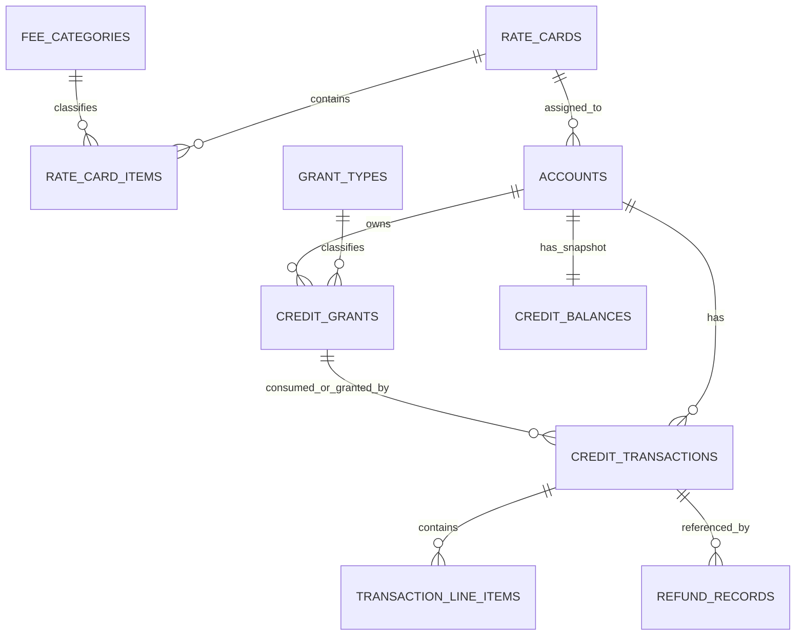

# Credits 数据库说明文档

## 1. 文档范围

本文档以 [schema.sql](../src/main/resources/schema.sql) 为准，描述当前项目在 MySQL 8.0 语义下的数据库模型、ER 关系、关键字段、关键索引与关键路径 SQL。

本文档描述的是当前仓库状态，不是未来理想模型。

## 2. 设计目标

本系统围绕 Credits 生命周期建模，目标是同时满足以下几类需求：

- 账户主数据与费率管理
- Credits 授予、消耗、退款
- 收入确认与递延收入统计
- 审计追踪与幂等控制
- 后台列表、详情与看板查询

数据库设计采用了“三层事实 + 一层快照”的结构：

- `credit_grants`
  - 额度池事实
  - 记录“授予了什么、还剩多少、何时过期、按什么优先级消耗”
- `credit_transactions`
  - 交易事实
  - 记录“发生了什么操作、金额是多少、收入影响是多少”
- `refund_records`
  - 退款映射事实
  - 记录“哪笔交易退款到哪笔交易、退款比例是多少”
- `credit_balances`
  - 余额快照
  - 用于快速读，不是唯一事实来源

## 3. ER 模型



关系说明：

| 关系 | 说明 |
| --- | --- |
| `rate_cards -> rate_card_items` | 一个费率卡包含多条动作定价 |
| `rate_cards -> accounts` | 一个费率卡可绑定多个账户 |
| `grant_types -> credit_grants` | 一条授予记录必须归属一个授予类型 |
| `accounts -> credit_grants` | 一个账户拥有多条 grant |
| `accounts -> credit_transactions` | 一个账户有多条交易流水 |
| `accounts -> credit_balances` | 一个账户有且仅有一条余额快照 |
| `credit_grants -> credit_transactions` | 授予、消耗、退款交易可关联 grant |
| `credit_transactions -> refund_records` | 退款记录把原交易和退款交易关联起来 |
| `credit_transactions -> transaction_line_items` | 一笔交易理论上可拆到多个费用行项目 |

## 4. 表模型说明

### 4.1 字典与主数据表

#### `grant_types`

| 字段 | 说明 |
| --- | --- |
| `id` | 主键，`CHAR(36)` |
| `code` | 业务编码，唯一约束 |
| `is_revenue_bearing` | 是否形成收入，`purchased=1`，赠送/奖励通常为 `0` |
| `default_expiry_days` | 默认有效期天数，必须大于 0 |

作用：

- 定义授予类型
- 决定授予时交易类型与收入语义
- 决定默认过期时间

#### `fee_categories`

| 字段 | 说明 |
| --- | --- |
| `id` | 主键 |
| `code` | 业务编码，唯一约束 |
| `is_revenue` | 是否计入收入 |
| `is_refundable` | 是否允许退款 |
| `gl_account_code` | 总账科目编码 |

作用：

- 定义费用分类
- 为未来 `transaction_line_items` 提供财务归类

#### `rate_cards`

| 字段 | 说明 |
| --- | --- |
| `id` | 主键 |
| `currency` | 币种 |
| `status` | `draft` / `active` / `archived` |
| `effective_from` | 生效开始时间 |
| `effective_to` | 生效结束时间，`NULL` 表示无限期 |

作用：

- 管理费率版本
- 通过状态和时间窗口控制生命周期

#### `rate_card_items`

| 字段 | 说明 |
| --- | --- |
| `rate_card_id` | 所属费率卡 |
| `action_code` | 计费动作编码 |
| `unit_of_measure` | 计量单位 |
| `base_credit_cost` | 基础 credits 成本 |
| `fee_credit_cost` | 附加费用 credits 成本 |
| `fee_category_id` | 费用类目，可为空 |

约束：

- `UNIQUE(rate_card_id, action_code)` 保证一个费率卡下动作唯一

#### `accounts`

| 字段 | 说明 |
| --- | --- |
| `id` | 主键 |
| `name` | 账户名称 |
| `billing_email` | 账单邮箱 |
| `rate_card_id` | 当前绑定费率卡 |
| `status` | `active` / `suspended` / `closed` |
| `created_at` | 创建时间 |

作用：

- 作为交易、余额、grant 的根聚合实体

### 4.2 交易与余额表

#### `credit_grants`

这是最核心的额度池表。

| 字段 | 说明 |
| --- | --- |
| `id` | 主键 |
| `account_id` | 所属账户 |
| `grant_type_id` | 授予类型 |
| `source_reference` | 来源单号或活动编码 |
| `original_amount` | 初始授予 credits |
| `remaining_amount` | 当前剩余 credits |
| `cost_basis_per_unit` | 每 credit 成本，用于收入确认 |
| `expires_at` | 原始过期时间，可为空 |
| `consumption_priority` | 消费优先级：`0 promotional`，`1 bonus`，`2 purchased` |
| `grant_status` | `available` / `depleted` / `expired` |
| `sort_expires_at` | 排序用过期时间，`NULL expires_at` 会映射为远未来时间 |
| `metadata` | 扩展 JSON |

关键约束：

| 约束 | 说明 |
| --- | --- |
| `original_amount > 0` | 授予量必须为正 |
| `remaining_amount >= 0` | 剩余额度不可为负 |
| `remaining_amount <= original_amount` | 剩余额度不能超过授予量 |
| `cost_basis_per_unit >= 0` | 成本不可为负 |
| `consumption_priority IN (0,1,2)` | 优先级受控 |
| `grant_status IN (...)` | 状态受控 |

设计说明：

- `credit_grants` 是消费顺序的事实来源
- 当前消费热路径完全围绕这张表排序和加锁
- `sort_expires_at` 让“永不过期 grant 排最后”可以通过单表排序实现

#### `credit_balances`

这是账户余额快照表。

| 字段 | 说明 |
| --- | --- |
| `account_id` | 唯一约束，一账户一行 |
| `total_balance` | 总余额 |
| `purchased_balance` | 购买余额 |
| `promotional_balance` | 赠送余额 |
| `bonus_balance` | 奖励余额 |
| `updated_at` | 最近更新时间 |

关键约束：

| 约束 | 说明 |
| --- | --- |
| 所有余额字段 `>= 0` | 快照不可为负 |
| `total_balance = purchased + promotional + bonus` | 聚合一致性约束 |

设计说明：

- 这是性能导向的物化快照
- 当前系统所有余额列表与详情查询主要依赖这张表
- 真正的业务事实仍是 `credit_grants + credit_transactions`

#### `credit_transactions`

这是核心审计流水表。

| 字段 | 说明 |
| --- | --- |
| `id` | 主键 |
| `account_id` | 所属账户 |
| `grant_id` | 关联 grant，可为空 |
| `type` | `purchase` / `promotional` / `bonus` / `consumption` / `refund` / `expiration` / `adjustment` |
| `amount` | 正数为增加，负数为扣减 |
| `revenue_impact` | 收入影响金额 |
| `idempotency_key` | 幂等键，唯一约束 |
| `description` | 交易描述 |
| `created_at` | 交易时间 |

关键约束：

| 约束 | 说明 |
| --- | --- |
| `UNIQUE(idempotency_key)` | 幂等控制 |
| `amount <> 0` | 金额不能为 0 |
| `type IN (...)` | 交易类型受控 |

设计说明：

- 授予、消耗、退款都要落一条或多条流水
- 当前消费实现中，每扣减一个 grant 会生成一条 `consumption` 流水

#### `transaction_line_items`

| 字段 | 说明 |
| --- | --- |
| `transaction_id` | 所属交易 |
| `fee_category_id` | 费用类目 |
| `amount` | 行项目金额 |
| `revenue_impact` | 行项目收入影响 |
| `label` | 标签或说明 |

设计说明：

- 表结构已存在
- 当前主流程尚未真正落地写入
- 这是后续做基础费用与附加费用拆账的扩展点

#### `refund_records`

| 字段 | 说明 |
| --- | --- |
| `original_txn_id` | 原始消费交易 |
| `refund_txn_id` | 退款生成的新交易 |
| `reason` | `customer_request` / `service_error` / `policy` / `other` |
| `refund_pct` | 退款比例，`0.01` 到 `100.00` |
| `include_fees` | 是否包含费用一起退款 |
| `created_at` | 创建时间 |

关键约束：

| 约束 | 说明 |
| --- | --- |
| `UNIQUE(refund_txn_id)` | 一条退款交易只能映射一次 |
| `original_txn_id <> refund_txn_id` | 禁止自指 |
| `refund_pct` 范围受限 | 防止异常比例 |

设计说明：

- 退款比例和原交易、退款交易的映射都落在这里
- “累计已退款金额”依赖这张表回查

## 5. 关键字段语义

### 5.1 消费排序相关字段

| 字段 | 所在表 | 语义 |
| --- | --- | --- |
| `consumption_priority` | `credit_grants` | 把业务优先级固化到单表字段，避免热路径再 `JOIN grant_types` |
| `grant_status` | `credit_grants` | 把“是否还有余额”从范围判断转换成受控状态 |
| `sort_expires_at` | `credit_grants` | 把 `NULL expires_at` 规范化，支持稳定排序 |

### 5.2 收入确认相关字段

| 字段 | 所在表 | 语义 |
| --- | --- | --- |
| `is_revenue_bearing` | `grant_types` | 是否形成收入 |
| `cost_basis_per_unit` | `credit_grants` | 单位成本 |
| `revenue_impact` | `credit_transactions` | 单笔交易收入影响金额 |

### 5.3 幂等与审计相关字段

| 字段 | 所在表 | 语义 |
| --- | --- | --- |
| `idempotency_key` | `credit_transactions` | 授予、消耗、退款幂等控制 |
| `source_reference` | `credit_grants` | 授予来源，可用于支付单或活动编码追溯 |
| `original_txn_id` / `refund_txn_id` | `refund_records` | 退款链路映射 |

## 6. 关键索引设计

| 索引 | 所在表 | 列 | 作用 |
| --- | --- | --- | --- |
| `uk_grant_types_code` | `grant_types` | `(code)` | 授予类型按编码唯一查找 |
| `idx_rc_status_effective` | `rate_cards` | `(status, effective_from, effective_to)` | 生效费率卡查询 |
| `uk_rci_card_action` | `rate_card_items` | `(rate_card_id, action_code)` | 费率动作定价定位 |
| `idx_accounts_rate_card` | `accounts` | `(rate_card_id)` | 按费率卡查账户 |
| `idx_accounts_status` | `accounts` | `(status)` | 按状态查账户 |
| `idx_cg_account_created` | `credit_grants` | `(account_id, created_at, id)` | 账户 grant 列表 |
| `idx_cg_consume_pick` | `credit_grants` | `(account_id, grant_status, consumption_priority, sort_expires_at, id)` | 消费热路径小批量选取 |
| `idx_cg_grant_type` | `credit_grants` | `(grant_type_id)` | 授予类型聚合与关联 |
| `uk_cb_account` | `credit_balances` | `(account_id)` | 一账户一快照 |
| `uk_ct_idempotency` | `credit_transactions` | `(idempotency_key)` | 幂等查询 |
| `idx_ct_account_created` | `credit_transactions` | `(account_id, created_at)` | 账户交易流水分页 |
| `idx_ct_grant` | `credit_transactions` | `(grant_id)` | grant 维度追踪 |
| `idx_ct_type_created` | `credit_transactions` | `(type, created_at)` | 消费/收入报表 |
| `idx_rr_original_txn` | `refund_records` | `(original_txn_id)` | 查询退款历史 |
| `uk_rr_refund_txn` | `refund_records` | `(refund_txn_id)` | 防止重复挂接退款交易 |

## 7. 关键路径 SQL

以下 SQL 均采用 MySQL 8.0 支持的语法。

### 7.1 查询账户动作定价

```sql
SELECT a.id,
       a.status,
       a.rate_card_id,
       rci.id AS rate_card_item_id,
       rci.base_credit_cost,
       rci.fee_credit_cost
FROM accounts a
JOIN rate_card_items rci
  ON rci.rate_card_id = a.rate_card_id
WHERE a.id = ?
  AND rci.action_code = ?;
```

用途：

- 消费前定位动作单价

### 7.2 消费幂等校验

```sql
SELECT id,
       account_id,
       grant_id,
       type,
       amount
FROM credit_transactions
WHERE idempotency_key = ?;
```

用途：

- 防止重复消耗
- 防止重复退款

### 7.3 小批量锁定当前可消费 grant

```sql
SELECT id,
       grant_type_id,
       remaining_amount,
       cost_basis_per_unit,
       consumption_priority,
       grant_status,
       sort_expires_at
FROM credit_grants
WHERE account_id = ?
  AND grant_status = 'available'
  AND sort_expires_at > CURRENT_TIMESTAMP
ORDER BY consumption_priority ASC,
         sort_expires_at ASC,
         id ASC
LIMIT ?
FOR UPDATE;
```

用途：

- 当前消费热路径核心 SQL
- 只锁本批候选 grant，而不是锁全账户所有活跃 grant

说明：

- MySQL 8.0 支持 `FOR UPDATE`
- 如果未来进一步优化并发，可评估 `FOR UPDATE SKIP LOCKED`

### 7.4 更新单个 grant 的剩余额度和状态

```sql
UPDATE credit_grants
SET remaining_amount = ?,
    grant_status = ?
WHERE id = ?;
```

用途：

- 消费扣减
- 退款回补

### 7.5 原子更新账户余额快照

```sql
UPDATE credit_balances
SET total_balance = total_balance + ?,
    purchased_balance = purchased_balance + ?,
    promotional_balance = promotional_balance + ?,
    bonus_balance = bonus_balance + ?
WHERE account_id = ?;
```

用途：

- 授予、消耗、退款都通过这条模式维护快照

### 7.6 查询某笔消费已退款总额

```sql
SELECT COALESCE(SUM(ct.amount), 0) AS refunded_amount
FROM refund_records rr
JOIN credit_transactions ct
  ON ct.id = rr.refund_txn_id
WHERE rr.original_txn_id = ?;
```

用途：

- 退款前判断剩余可退金额

### 7.7 写入退款记录

```sql
INSERT INTO refund_records (
    id,
    original_txn_id,
    refund_txn_id,
    reason,
    refund_pct,
    include_fees
) VALUES (?, ?, ?, ?, ?, ?);
```

用途：

- 建立原交易和退款交易的映射

### 7.8 查询账户 grant 列表

```sql
SELECT id,
       account_id,
       grant_type_id,
       source_reference,
       original_amount,
       remaining_amount,
       cost_basis_per_unit,
       currency,
       expires_at,
       created_at,
       consumption_priority,
       grant_status,
       sort_expires_at,
       metadata
FROM credit_grants
WHERE account_id = ?
ORDER BY created_at ASC,
         id ASC;
```

用途：

- 账户详情页查看 grant 历史

### 7.9 查询账户交易流水

```sql
SELECT id,
       account_id,
       grant_id,
       type,
       amount,
       revenue_impact,
       idempotency_key,
       description,
       created_at
FROM credit_transactions
WHERE account_id = ?
ORDER BY created_at DESC,
         id DESC
LIMIT ?
OFFSET ?;
```

用途：

- 账户详情页查看交易历史

### 7.10 计算递延收入

```sql
SELECT COALESCE(SUM(remaining_amount * cost_basis_per_unit), 0) AS deferred_revenue
FROM credit_grants
WHERE grant_status = 'available'
  AND sort_expires_at > CURRENT_TIMESTAMP;
```

用途：

- 看板或财务视图中计算未释放的收入余额

### 7.11 按月汇总已确认收入

```sql
SELECT DATE_FORMAT(created_at, '%Y-%m') AS month,
       SUM(revenue_impact) AS recognized_revenue
FROM credit_transactions
WHERE type = 'consumption'
GROUP BY DATE_FORMAT(created_at, '%Y-%m')
ORDER BY month ASC;
```

用途：

- 月度收入趋势图

### 7.12 统计各授予类型的总数与活跃数

```sql
SELECT grant_type_id,
       COUNT(*) AS total,
       SUM(
           CASE
               WHEN grant_status = 'available'
                AND sort_expires_at > CURRENT_TIMESTAMP
               THEN 1
               ELSE 0
           END
       ) AS active
FROM credit_grants
GROUP BY grant_type_id;
```

用途：

- 授予类型管理页查看总 grant 数与活跃 grant 数

## 8. 当前模型的关键业务语义

### 8.1 哪些表是“事实来源”

| 表 | 角色 |
| --- | --- |
| `credit_grants` | 额度池事实 |
| `credit_transactions` | 交易事实 |
| `refund_records` | 退款映射事实 |
| `credit_balances` | 快照，不是唯一事实来源 |

### 8.2 消费顺序如何确定

当前消费顺序由 `credit_grants` 单表字段决定：

1. `consumption_priority`
2. `sort_expires_at`
3. `id`

这意味着：

- 赠送额度优先于奖励额度
- 奖励额度优先于购买额度
- 同优先级内，越早过期越先消耗
- 永不过期 grant 通过 `sort_expires_at` 排在最后

### 8.3 退款如何回补

退款不会直接“按账户总额加回”就结束，而是会：

1. 找到原始消费交易
2. 校验累计已退款金额
3. 回补到原始 `grant_id`
4. 按原始 grant 类型回补到正确的余额桶

## 9. 当前模型边界

### 9.1 已实现边界

- 支持授予、消耗、退款
- 支持账户级余额快照
- 支持 grant 级 FIFO 类消费顺序
- 支持幂等控制
- 支持递延收入与消费收入统计

### 9.2 尚未完全落地的边界

| 项目 | 当前状态 |
| --- | --- |
| `transaction_line_items` 写入 | 表已建，主流程尚未完全使用 |
| 费用级退款 | `include_fees` 已建模，精细拆账未完全落地 |
| grant 过期任务 | 当前主要依赖查询条件 `sort_expires_at > CURRENT_TIMESTAMP`，未见独立定时过期任务 |

## 10. 一句话总结

这个数据库模型的核心思想是：

- 用 `credit_grants` 表示额度池
- 用 `credit_transactions` 表示审计流水
- 用 `refund_records` 表示退款链路
- 用 `credit_balances` 表示读优化快照

在当前实现里，这套模型已经足以支撑 Credits 的授予、消耗、退款、余额查询和基础财务统计，并且消费热路径已经收敛到 MySQL 8.0 可优化的单表有序查询模型。
